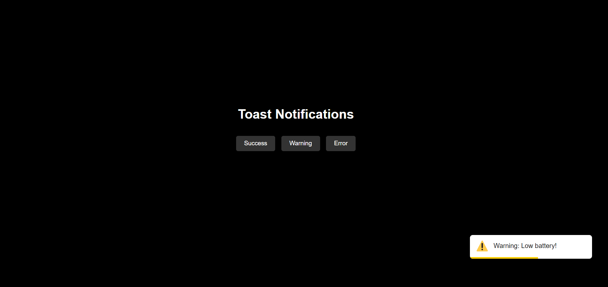

# Toast Notification Demonstration

This project demonstrates how to create toast notifications using HTML, CSS, and JavaScript. Toast notifications are small, non-intrusive messages that appear temporarily on the screen to provide feedback or alerts to the user.


## Usage

1. Clone the repository to your local machine:
    git clone https://github.com/HmadAfzal/Toast-Notifications.git
    ```

2. Open the `index.html` file in your preferred web browser.

3. Click on the buttons to trigger different types of toast notifications:

    - "Success": Displays a success message.
    - "Warning": Displays a warning message.
    - "Error": Displays an error message.

    

## Implementation

The toast notifications are implemented using HTML, CSS, and JavaScript.

- **HTML**: The structure of the toast notification is defined using HTML `<div>` elements.
  
- **CSS**: The styling for the toast notifications is provided in the `style.css` file to ensure they appear visually appealing and consistent.
  
- **JavaScript**: The functionality to create and display toast notifications is implemented using JavaScript. When a button is clicked, an event listener creates a new `<div>` element with the appropriate content based on the button clicked and appends it to the main body. The toast notification is then automatically removed after 5 seconds using the `setTimeout()` function.

